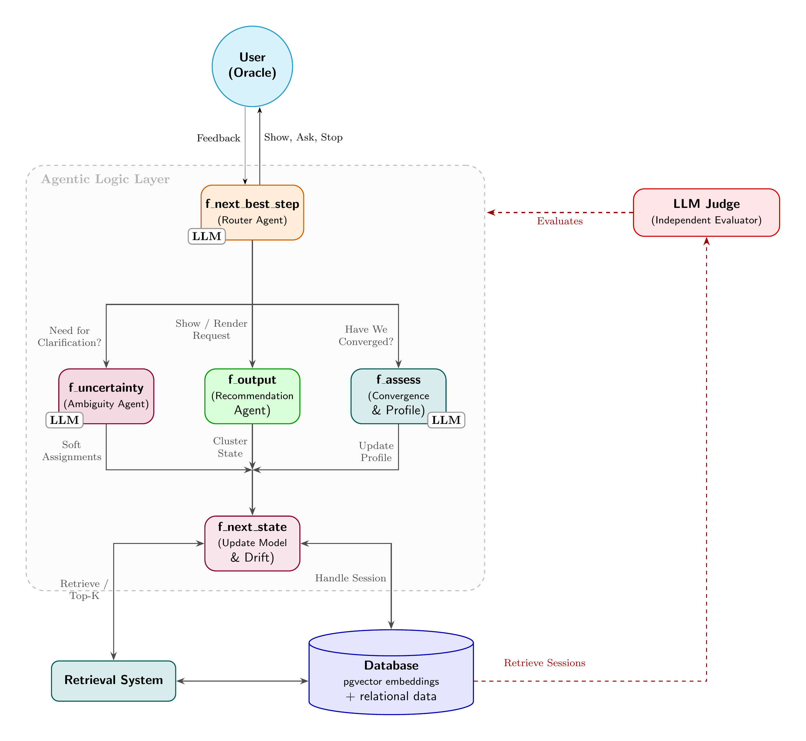

# Architecture Diagram

This diagram captures the **online conversational loop** from the problem statement: `f_next_best_step` (router), `f_uncertainty`, `f_output`, `f_next_state`, and `f_assess`, with persistent state and retrieval support.

## Diagram components (from `architecture_diagram.tex`)

| Component | Function in problem statement | Purpose |
|---|---|---|
| **User (Oracle)** | Oracle | Provides feedback and receives system actions |
| **`f_next_best_step` (Router Agent)** | Router | Chooses **Show / Ask / Stop** and sets the next action |
| **`f_uncertainty` (Ambiguity Agent)** | Uncertainty estimator | Surfaces boundary/ambiguous cases |
| **`f_output` (Recommendation Agent)** | Output function | Produces best current recommendation view, and doesn't need to update the model or handle any kind of feedback |
| **`f_assess` (Convergence & Profile)** | Assessor | Decides convergence and updates profile |
| **`f_next_state` (Update Model & Drift)** | State update | Applies latest oracle feedback, handles drift |
| **Retrieval System** | Retrieval stage | Fetches relevant candidates/top-K |
| **Database (`pgvector` + relational data)** | Persistent memory | Stores session state and retrieval data through embeddings |
| **LLM Judge (Independent Evaluator)** | Offline evaluation | Reads stored sessions and evaluates externally |

## Flow encoded in the diagram

1. **Oracle ↔ Router**: feedback enters from the oracle; router returns Show/Ask/Stop actions.
2. **Router → Agents**: router dispatches to `f_uncertainty`, `f_output`, and `f_assess`.
3. **Agents → `f_next_state`**: uncertainty/output/assessment signals feed state update.
4. **`f_next_state` ↔ Retrieval / Database**: state update retrieves candidates and persists session updates.
5. **Database → LLM Judge**: judge retrieves sessions for independent scoring outside the live loop.