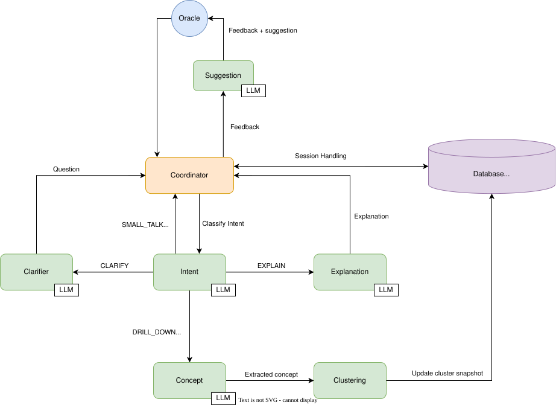
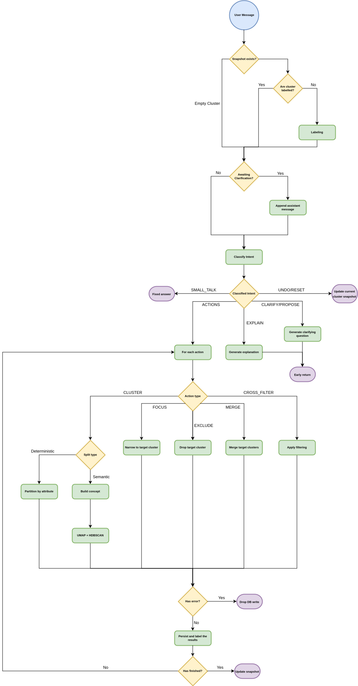

# Architecture Diagram

This captures the **online conversational loop**: a single **Coordinator** orchestrates one user
message at a time through a deterministic agent pipeline — **Intent** classification, an optional
**Clarifier** gate, one or more **Clustering** operations (each optionally guided by a **Concept**
and finalised by **Labeling**), an **Explanation** path, and a **Responder** that may volunteer a
follow-up suggestion. Cluster state is stored as a content-addressed tree of snapshots in the
vector database.


## System components



| Component | Role in system | Purpose |
|---|---|---|
| **User (Oracle)** | Oracle | The source of truth: a human participant or an MCP/LLM client. Sends free-form natural-language messages requesting clustering operations, explanations, or navigation. |
| **Coordinator** | Orchestration & handoffs | The sole orchestrator and **only writer to the database**. Per message it loads current cluster state, labels any unlabeled clusters, classifies intent, applies a confidence gate, executes each requested action in order, and optionally asks the Responder for a suggestion. Holds no in-memory session state — every turn re-reads from the DB. |
| **Intent Agent** | Intent classification | Parses the oracle's message into an ordered list of actions, each tagged with a `NavigationMode` or `DialogueMode`, a confidence score, and operation-specific parameters (concept, target cluster, merged label, metadata filter, embedding modalities).|
| **Clustering Agent** | Grouping & navigation | Five pure operations over movie embeddings — `drill_down`, `merge`, `focus`, `cross_filter`, `partition_by` — each producing a draft snapshot of clusters with per-movie soft-membership probabilities. Runs no LLM call itself; concept scoring and HDBSCAN do the work. Never writes to the DB. |
| **Concept Agent** | Semantic axis building | Turns a user concept string (e.g. "surrealism") into either a `linear_axis` (normalized difference of pole descriptions) or a `prototype` (centroid of exemplar movie embeddings). Used to guide drill-down and cross-filter splits. Uses the strong model. |
| **Labeling Agent** | Naming | A single batched LLM call that names and summarises all unlabeled clusters at once (root clusters are ingested unlabeled and labelled lazily on first access). Uses the fast model. |
| **Clarifier Agent** | Disambiguation gate | When any state-changing action falls below the configured confidence threshold, produces a clarification question and the turn returns early without mutating state. |
| **Explanation Agent** | Placement rationale | Generates a natural-language explanation for why a given movie sits in a given cluster, using the cluster label and exemplars. Read-only. Uses the strong model. |
| **Responder Agent** | Proactive suggestions | After actions complete, computes deterministic signals (similar cluster pairs, a dominant cluster, high noise fraction) and only if a signal exceeds threshold calls the LLM to propose a next step. May decline. Uses the fast model. |
| **Vector Database** | Persistent memory | Stores catalogue embeddings (three modalities), conversations and messages, the content-addressed cluster-snapshot tree, clusters, soft memberships, and concepts. |


## Operations & natural-language control

The oracle never picks an operation from a menu — they type free-form text, and the **Intent agent**
maps it onto a fixed, closed set of operations.
We can distinguish two families: 
- **Navigation operations** (`NavigationMode`) re-cluster the data, producing a new snapshot;
- **Dialogue operations** (`DialogueMode`) navigate, explain, or chat without producing new clusters.

| Operation | Family | Definition | Illustrative phrasing |
|---|---|---|---|
| `drill_down` | navigation | Split one cluster further along a semantic concept, or re-cluster the full catalogue when no target is given. | "break the noir group down by how violent they are", "cluster these further" |
| `merge` | navigation | Combine two or more clusters into one under a chosen label. | "these two are basically the same, combine them" |
| `focus` | navigation | Discard every cluster except the selected one, narrowing the working set to its members. | "just keep the sci-fi cluster" |
| `cross_filter` | navigation | Keep only movies matching a metadata predicate (genres, year range, director) | "only 90s movies directed by Spielberg, then regroup" |
| `partition_by` | navigation | Group a cluster (or the whole catalogue) into contiguous buckets of a numeric attribute (`runtime`, `release_year`, `vote_average`). When no bins are supplied the Coordinator proposes round-number defaults and asks the oracle to confirm before clustering. | "split by decade", "group by runtime" |
| `reset` | dialogue | Return to the unclustered state (no active snapshot). | "start over" |
| `go_to_base` | dialogue | Jump back to the pre-computed ingest-time base clustering. | "go back to the original groups" |
| `explain` | dialogue | Explain why a given movie sits in a given cluster. | "why is Blade Runner in this group?" |
| `small_talk` | dialogue | Casual, non-operational message; answered with a static help reply. | "what can you do?" |

The Intent agent emits an **ordered list of actions**, so a single message can request a compound
sequence (e.g. *"reset, then split everything by mood"* → `reset` then `drill_down`); the Coordinator
executes them in order, threading each resulting snapshot into the next. 

Each action carries
`target_cluster_id`, `concept`, `metadata_filter`, `merged_label`, `embedding_spaces`, `confidence`,
and `partition_spec` — all inferred from natural language. For `partition_by`, if no bins are
supplied the Coordinator calls the deterministic `propose_bins` helper to suggest round-number edges
and returns a proposal for the oracle to confirm before clustering. When a state-changing action's
`confidence` falls below the configured threshold the **Clarifier** asks a disambiguating question
instead of guessing (see Turn Handling, Phase 3).

## Embeddings & fusion

Each movie carries up to three 1024-dimensional, L2-normalised embeddings, matching the `Modality`
enum and the embedding columns in `data_schema.md`. The encoding primitives live in `core/` and are
shared with the offline ingest pipeline; the online loop only reads stored vectors.

| Modality | Model | Encodes | Column |
|---|---|---|---|
| `TEXT` | `BAAI/bge-large-en-v1.5` (sentence-transformers) | `composite_text` (title, overview, genres, cast, director, …) | `text_embedding` |
| `REVIEW` | `BAAI/bge-large-en-v1.5` | `reviews_text` (concatenated reviews) | `review_embedding` |
| `TRAILER` | open_clip `ViT-H/14` | 16 evenly-spaced trailer frames, CLIP-encoded then mean-pooled (fallback to the poster if no trailer is available) | `trailer_embedding` |

**Fusion** (`core/fusion.py`) takes two paths.
- Text and reviews share the same BGE space and are combined by a **weighted vector average** (`fuse_batch`); rows without a review stay text-only.
- BGE text and CLIP trailer embeddings are combined at the **distance level** (`combined_distance_matrix`): a full cosine-distance matrix is computed per modality and the matrices are weighted-summed:

  ```
  d_combined(A, B) = ( w_text · d_text(A, B) + w_trailer · d_trailer(A, B) ) / (w_text + w_trailer)
  ```

The intent agent picks which modalities to fuse per operation via `embedding_spaces`.

## Clustering

The Clustering Agent (`core/clustering.py`, `backend/agents/clustering/operations/`) is a pure
computation layer: it receives embeddings or a precomputed distance matrix and returns a
`ClusterSnapshotDraft`; it never writes to the DB.

**Algorithm** — embeddings are first reduced with UMAP, then grouped with **HDBSCAN soft
clustering**. Each movie receives a per-cluster membership probability; noise points are spread
uniformly across clusters so every movie always belongs somewhere.

**Cross-space operations** — when both TEXT and TRAILER modalities are active, the precomputed
combined distance matrix (`core/fusion.py:combined_distance_matrix`) is fed directly to HDBSCAN
instead of fusing embedding vectors.

**Concept-guided drill-down** — when a `drill_down` action carries a concept, the Concept agent
produces either a `linear_axis` (normalised difference of two pole descriptions) or a `prototype`
(centroid of exemplar movie embeddings). Every movie in scope is scored against this axis; the set
is split at the **median** score into high/low halves, and each half is clustered independently to
produce more concept-coherent groups.

**Persist & label** (`backend/agents/coordinator/tools/persist.py`) — after the Clustering Agent
returns a draft, the Coordinator checks the **content-addressed cache** keyed by
`(parent_snapshot_id, operation, canonical_params, config_hash)`. On a cache hit the existing
snapshot is reused with no re-labelling cost. On a miss: a new `cluster_snapshots` row is created,
the Labeling Agent names all clusters in one batched LLM call, memberships are bulk-inserted, and
`conversations.current_cluster_snapshot_id` is updated.

## Navigating the execution graph

Every navigation operation is recorded as a node in a persistent graph rather than mutating state in
place, which is what lets the oracle move backward and sideways through the exploration — not just
forward. Two structures (defined in `data_schema.md`) make this work:

- **The snapshot lineage.** Each `cluster_snapshots` row stores the `parent_id` of the snapshot it
  was derived from, plus the `operation` and the canonical `params` that produced it. Following
  `parent_id` upward gives the exact chain of operations that built any state, back to the ingest-time
  root (`operation = 'base'`, `parent_id = NULL`). A single conversation's snapshots therefore form a
  tree: a linear path while the oracle keeps refining, branching whenever they back up and try a
  different operation from an earlier point.
- **Per-conversation membership.** `conversation_snapshot_refs` records every snapshot a conversation
  has touched, decoupled from lineage, so a conversation "owns" its visited states even though the
  snapshots themselves are shared.

**Going back** is just re-pointing `conversations.current_cluster_snapshot_id` at an earlier node — no
recomputation. `PATCH /conversations/{id}` (and the MCP `navigate_to_snapshot` tool) sets the active
snapshot to any prior snapshot id; the `go_to_base` operation is the special case of jumping to the
root, and `reset` clears the pointer to the unclustered state. `GET /conversations/{id}/cluster-snapshots`
returns the whole node set (id, parent_id, operation, created_at) so a client can render the tree and
let the oracle click a past state to return to it.

**Branching and reuse** fall out of the same design. Issuing a new operation from a state the oracle
has rewound to simply creates a new child of that node — the prior branch is untouched and still
reachable. And because snapshots are **content-addressed** by `(parent_id, operation, params,
config_hash)`, re-deriving a state that already exists (in this or another conversation) reuses the
cached node instead of re-clustering, so revisiting and replaying paths is cheap. Deleting a snapshot
is restricted to leaves (`409` otherwise) and reparents any conversation pointing at it to the
snapshot's parent, so the graph never loses a state that is still on someone's path.

## Turn Handling



Each user message is handled by a stateless `Coordinator.handle_message`
(`backend/agents/coordinator/agent.py`), which loads current state from the DB, runs a
**deterministic sequential pipeline**, and writes results back. A `ProgressReporter` emits SSE
step events throughout (consumed by `GET /conversations/{id}/events`).

### Phase 1 — Load, label & context

The Coordinator reads the conversation's `current_cluster_snapshot_id` and its clusters. If any
cluster is unlabeled (true for freshly ingested root clusters), it emits a `labeling` step and
labels them all in one batched call, persisting the labels. It then checks `take_awaiting(conversation_id)`:
if the prior turn ended with a clarification question, the Coordinator fetches that assistant message
and passes it to the Intent agent so follow-up answers ("the first option", "yes, that one") resolve
correctly.

### Phase 2 — Intent classification

It emits an `intent` step and calls the Intent agent, which returns one or more ordered actions.
Compound requests (e.g. *reset then drill-down*) come back as a multi-element list.

### Phase 3 — Confidence gate (routing gate)

If **any** state-changing action (`DRILL_DOWN`, `MERGE`, `FOCUS`, `CROSS_FILTER`, `RESET`,
`GO_TO_BASE`) has confidence below `intent.confidence_threshold`, the Coordinator emits a
`clarifier` step, returns a clarification question, and **exits early without mutating state**.
Otherwise it proceeds to dispatch.

### Phase 4 — Sequential action execution

For each action in order, the Coordinator re-reads the current snapshot's clusters (so later
actions see the post-operation state), bundles them into an immutable `ActionContext`, and
dispatches to the matching handler. Each handler returns `(reply_fragment, new_snapshot_id, cost)`.

| Mode | Handler | Behaviour | DB write |
|---|---|---|---|
| `DialogueMode.SMALL_TALK` | `handle_small_talk` | Static help reply | none |
| `DialogueMode.RESET` | `handle_reset` | Clear active snapshot (unclustered state) | `set_current_cluster_snapshot(None)` |
| `DialogueMode.GO_TO_BASE` | `handle_go_to_base` | Navigate to the ingest-time root snapshot | set current snapshot + record snapshot ref |
| `DialogueMode.EXPLAIN` | `handle_explain` | Explain a movie's placement (`explain` step) | none (read-only) |
| `NavigationMode.DRILL_DOWN` | `handle_drill_down` | Optional `concept` step → `clustering` step → `persist_and_label` | via `persist_and_label` |
| `NavigationMode.MERGE` | `handle_merge` | Merge first two clusters → `clustering` step → `persist_and_label` | via `persist_and_label` |
| `NavigationMode.FOCUS` | `handle_focus` | Narrow to one cluster → `clustering` step → `persist_and_label` | via `persist_and_label` |
| `NavigationMode.CROSS_FILTER` | `handle_cross_filter` | Metadata filter → optional `concept` step → `clustering` step → `persist_and_label` | via `persist_and_label` |
| `NavigationMode.PARTITION_BY` | `handle_partition_by` | When numeric bins are absent: call `propose_bins` → return proposal, mark awaiting (no DB write). When bins are confirmed: `clustering` step → `persist_and_label` | via `persist_and_label` (confirmed path only) |

Clustering handlers go through `persist_and_label`, which first checks the content-addressed cache
`(parent_id, operation, params, config_hash)`; on a hit it reuses the existing snapshot and skips
both clustering and labelling.

### Phase 5 — Suggestion & return

The Coordinator joins reply fragments (numbered when there is more than one), emits a `suggester`
step, and calls the Responder's `maybe_suggest` on the final snapshot. The Responder computes
deterministic signals and only calls the LLM if one trips — otherwise no suggestion is returned. A
`turn_done` event is emitted, and the Coordinator returns a `CoordinatorResult` with the combined
reply, final snapshot id, this turn's cost, and the optional suggestion. The router then persists
the assistant message and adds the turn cost to the conversation.

**SSE progress steps**, in emission order: `labeling`, `intent`, `clarifier`, `concept`,
`clustering`, `explain`, `suggester`, then the terminal `turn_done`.

